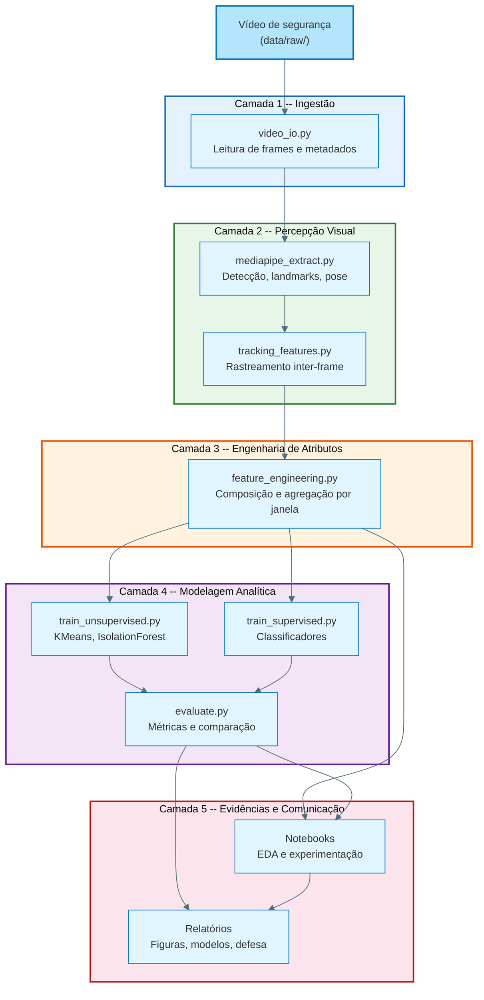
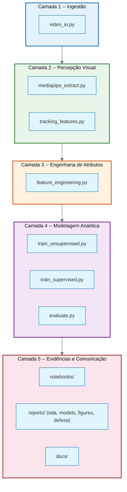
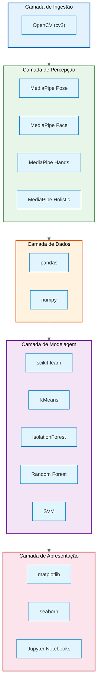
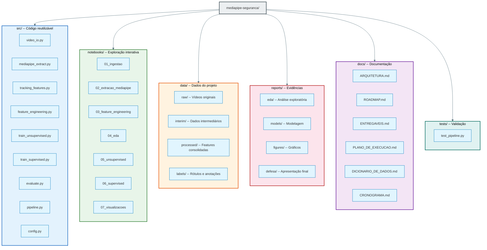
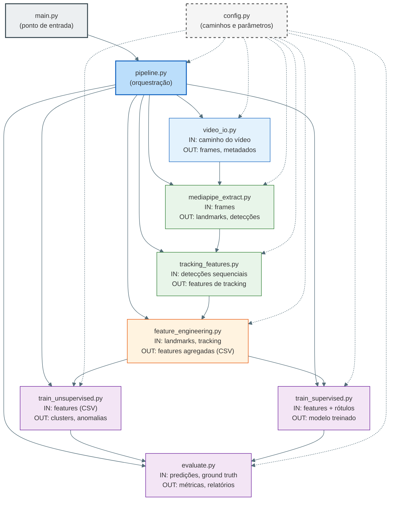

# Arquitetura do projeto

Este documento descreve a arquitetura lógica do projeto, conectando objetivos acadêmicos, organização do repositório e fluxo da pipeline.

## Navegação

- [Início](../README.md)
- [Contribuição](../CONTRIBUTING.md)
- [Cronograma](CRONOGRAMA.md)
- [Entregáveis](ENTREGAVEIS.md)
- [Estratégia de dados e modelagem](ESTRATEGIA_DADOS_E_MODELAGEM.md)
- [Plano de execução](PLANO_DE_EXECUCAO.md)
- [Roadmap](ROADMAP.md)
- [Dicionário de dados](DICIONARIO_DE_DADOS.md)
- [Dados](../data/README.md)
- [Notebooks](../notebooks/README.md)
- [Relatórios](../reports/README.md)
- [Código-fonte](../src/README.md)

---

## Visão geral

O projeto segue uma arquitetura orientada a pipeline, na qual vídeos de segurança são transformados em sinais visuais, depois em atributos analíticos, e por fim em evidências quantitativas e visuais para análise e defesa acadêmica.

O diagrama a seguir apresenta o fluxo completo da pipeline, desde a entrada de vídeo até a geração de evidências, agrupado por camadas de responsabilidade.

### Diagrama da Pipeline

---

## Camadas principais

A arquitetura é organizada em cinco camadas empilhadas, cada uma com responsabilidade bem definida. O diagrama abaixo ilustra a hierarquia e os módulos de cada camada.

### Diagrama de Camadas

### 1. Ingestão

Responsável por ler os dados de entrada e organizar a base temporal mínima do projeto.

- origem principal: `data/raw/`
- módulo relacionado: `src/mediapipe_seguranca/video_io.py`
- saídas típicas: metadados de vídeo, frames, janelas temporais

### 2. Percepção visual

Responsável por extrair sinais relevantes das imagens e vídeos.

- módulo relacionado: `src/mediapipe_seguranca/mediapipe_extract.py`
- módulo auxiliar: `src/mediapipe_seguranca/tracking_features.py`
- tecnologia-alvo: MediaPipe
- saídas típicas: detecções, landmarks, presença de pessoas, sinais espaciais, rastreamento inter-frame

### 3. Engenharia de atributos

Responsável por transformar sinais brutos em variáveis interpretáveis para EDA e modelagem.

- módulos relacionados:
  - `src/mediapipe_seguranca/tracking_features.py`
  - `src/mediapipe_seguranca/feature_engineering.py`
- saídas típicas: contagem, densidade, permanência, velocidade, score de risco, agregações por janela

### 4. Modelagem analítica

Responsável por descobrir padrões e classificar eventos.

- trilha não supervisionada: `src/mediapipe_seguranca/train_unsupervised.py`
- trilha supervisionada: `src/mediapipe_seguranca/train_supervised.py`
- avaliação: `src/mediapipe_seguranca/evaluate.py`

### 5. Evidências e comunicação

Responsável por transformar resultados em material utilizável para análise e defesa.

- notebooks: `notebooks/`
- relatórios: `reports/`
- planejamento: `docs/`

---

## Stack tecnológica

A tabela e o diagrama abaixo mostram as tecnologias utilizadas em cada camada do projeto.

| Camada | Bibliotecas / Ferramentas |
|---|---|
| Apresentação | matplotlib, seaborn, Jupyter Notebooks |
| Modelagem | scikit-learn (KMeans, IsolationForest, Random Forest, SVM, etc.) |
| Dados | pandas, numpy |
| Percepção | MediaPipe (Pose, Face, Hands, Holistic) |
| Ingestão | OpenCV (cv2) |

### Diagrama da Stack Tecnológica

---

## Fluxo de dados

Os dados percorrem uma cadeia bem definida de diretórios, cada etapa produzindo artefatos intermediários que alimentam a etapa seguinte. O diagrama abaixo detalha esse fluxo com os tipos de arquivo em cada estágio.

### Diagrama de Fluxo de Dados

```mermaid
%%{init: {'theme': 'base', 'themeVariables': {'primaryColor': '#e1f5fe', 'primaryBorderColor': '#0277bd', 'lineColor': '#546e7a', 'fontSize': '14px'}}}%%
flowchart LR
    subgraph RAW["data/raw/"]
        R1["Vídeos (.mp4, .avi)"]
    end

    subgraph PROC_1["Processamento"]
        P1A["video_io.py<br/>Leitura de frames"]
        P1B["mediapipe_extract.py<br/>Detecção e landmarks"]
    end

    subgraph INTERIM["data/interim/"]
        I1["Landmarks (.csv)"]
        I2["Detecções (bounding boxes)"]
        I3["Sinais espaciais"]
    end

    subgraph TRANSF["Transformação"]
        T1["tracking_features.py<br/>Rastreamento"]
        T2["feature_engineering.py<br/>Agregação por janela"]
    end

    subgraph PROCESSED["data/processed/"]
        PR1["Features consolidadas (.csv)"]
        PR2["Datasets prontos (.parquet)"]
    end

    subgraph LABELS["data/labels/"]
        LB1["Rótulos e anotações (.csv)"]
    end

    subgraph ANALISE["Análise e Modelagem"]
        AN1["train_unsupervised.py"]
        AN2["train_supervised.py"]
        AN3["evaluate.py"]
        AN4["Notebooks EDA"]
    end

    subgraph REPORTS["reports/"]
        RE1["reports/eda/<br/>Exploratória"]
        RE2["reports/models/<br/>Resultados"]
        RE3["reports/figures/<br/>Gráficos"]
        RE4["reports/defesa/<br/>Apresentação"]
    end

    RAW --> PROC_1
    PROC_1 --> INTERIM
    INTERIM --> TRANSF
    LABELS --> TRANSF
    TRANSF --> PROCESSED
    PROCESSED --> ANALISE
    ANALISE --> REPORTS

    style RAW fill:#e3f2fd,stroke:#1565c0,stroke-width:2px
    style PROC_1 fill:#e8eaf6,stroke:#283593,stroke-width:1px,stroke-dasharray: 5 5
    style INTERIM fill:#e8f5e9,stroke:#2e7d32,stroke-width:2px
    style TRANSF fill:#fff8e1,stroke:#f57f17,stroke-width:1px,stroke-dasharray: 5 5
    style PROCESSED fill:#fff3e0,stroke:#e65100,stroke-width:2px
    style LABELS fill:#f1f8e9,stroke:#558b2f,stroke-width:2px
    style ANALISE fill:#f3e5f5,stroke:#6a1b9a,stroke-width:1px,stroke-dasharray: 5 5
    style REPORTS fill:#fce4ec,stroke:#b71c1c,stroke-width:2px
```

---

## Organização por responsabilidade

Cada diretório do repositório tem uma responsabilidade clara. O diagrama abaixo apresenta a árvore do projeto organizada por finalidade.

### Diagrama de Organização do Repositório

### Código-fonte

- concentra a lógica reutilizável e executável do projeto;
- deve permanecer independente de notebooks;
- organiza a pipeline em módulos com responsabilidade única.

### Dados

- separam origem, transformação intermediária, base final e rótulos;
- permitem rastreabilidade e defesa metodológica;
- evitam mistura entre insumo e artefato analítico.

### Notebooks

- concentram exploração, validação visual e experimentação analítica;
- servem como ponte entre pipeline e interpretação;
- não substituem módulos reutilizáveis em `src/`.

### Relatórios

- consolidam resultados em formato comunicável;
- organizam evidências para EDA, modelagem, figuras e defesa;
- reduzem dispersão de informação entre notebooks e documentação geral.

---

## Diagrama de componentes

O diagrama abaixo apresenta as dependências entre os módulos Python do projeto. O módulo `config.py` é utilizado por todos os demais, enquanto `pipeline.py` orquestra a execução sequencial das etapas.

### Diagrama de Dependências entre Módulos

---

## Ciclo de vida dos dados

O diagrama abaixo ilustra o ciclo completo de transformação dos dados ao longo do projeto, desde o vídeo bruto até a defesa acadêmica.

### Diagrama do Ciclo de Vida dos Dados

```mermaid
%%{init: {'theme': 'base', 'themeVariables': {'primaryColor': '#e1f5fe', 'primaryBorderColor': '#0277bd', 'lineColor': '#546e7a', 'fontSize': '14px'}}}%%
flowchart LR
    V["Vídeo bruto<br/>(.mp4, .avi)"]
    F["Frames<br/>(imagens individuais)"]
    L["Landmarks e Detecções<br/>(coordenadas por frame)"]
    FF["Features por frame<br/>(contagem, posição,<br/>velocidade)"]
    FW["Features por janela<br/>(agregações temporais,<br/>estatísticas)"]
    CL["Clusters e<br/>Classificações<br/>(padrões, anomalias)"]
    RL["Relatórios<br/>(gráficos, métricas,<br/>tabelas)"]
    DF["Defesa acadêmica<br/>(apresentação final)"]

    V --> F
    F --> L
    L --> FF
    FF --> FW
    FW --> CL
    CL --> RL
    RL --> DF

    style V fill:#e3f2fd,stroke:#1565c0,stroke-width:2px
    style F fill:#e3f2fd,stroke:#1565c0,stroke-width:1px
    style L fill:#e8f5e9,stroke:#2e7d32,stroke-width:2px
    style FF fill:#e8f5e9,stroke:#2e7d32,stroke-width:1px
    style FW fill:#fff3e0,stroke:#e65100,stroke-width:2px
    style CL fill:#f3e5f5,stroke:#6a1b9a,stroke-width:2px
    style RL fill:#fce4ec,stroke:#b71c1c,stroke-width:2px
    style DF fill:#fce4ec,stroke:#b71c1c,stroke-width:1px
```

---

## Ponto de entrada atual

- `main.py`: runner principal da pipeline demo.
- `src/mediapipe_seguranca/pipeline.py`: orquestração das etapas da base inicial.

## Estado atual da arquitetura

No estado atual, a arquitetura já suporta:

- execução de uma pipeline demonstrativa;
- geração de base sintética para validar o fluxo;
- organização de diretórios alinhada aos entregáveis;
- documentação separada por responsabilidade.

Os próximos avanços esperados são:

1. substituir a extração simulada por leitura real de vídeo;
2. integrar tasks reais do MediaPipe;
3. consolidar contrato de rótulos e datasets finais;
4. transformar notebooks planejados em notebooks executáveis;
5. preencher `reports/` com evidências concretas.

## Decisões arquiteturais

- **Separação entre pipeline e exploração**: lógica estável em `src/`, exploração em `notebooks/`.
- **Separação entre tipos de dados**: bruto, intermediário, processado e rótulos ficam em diretórios diferentes.
- **Separação entre análise e apresentação**: relatórios e figuras servem como ponte entre experimento e defesa.
- **Prioridade para rastreabilidade**: cada artefato deve indicar sua origem, etapa e finalidade.

## Relação com outros documentos

- [Roadmap](ROADMAP.md): fases de execução do projeto e dependências entre elas.
- [Cronograma](CRONOGRAMA.md): mapeamento detalhado das atividades do PI e seu progresso.
- [Plano de execução](PLANO_DE_EXECUCAO.md): etapas operacionais detalhadas.
- [Entregáveis](ENTREGAVEIS.md): matriz de artefatos e critérios de aceite.
- [Dicionário de dados](DICIONARIO_DE_DADOS.md): variáveis, tipos e granularidade produzidos pela pipeline.
