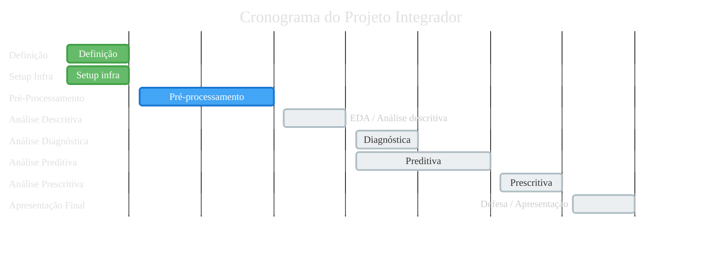
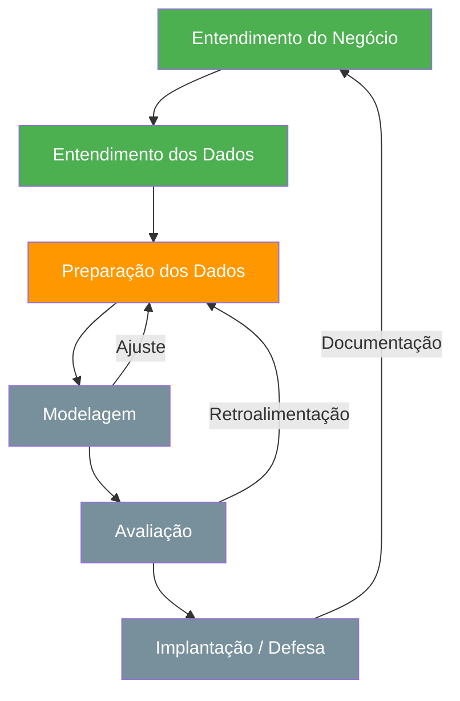

# Cronograma do Projeto Integrador

Este documento mapeia as atividades previstas no cronograma do Projeto Integrador (PI) da PUC ao estado atual do repositório, permitindo rastrear o progresso do projeto em relação às entregas acadêmicas esperadas.

## Navegação

- [Início](../README.md)
- [Contribuição](../CONTRIBUTING.md)
- [Arquitetura](ARQUITETURA.md)
- [Entregáveis](ENTREGAVEIS.md)
- [Estratégia de dados e modelagem](ESTRATEGIA_DADOS_E_MODELAGEM.md)
- [Plano de execução](PLANO_DE_EXECUCAO.md)
- [Roadmap](ROADMAP.md)
- [Dicionário de dados](DICIONARIO_DE_DADOS.md)
- [Dados](../data/README.md)
- [Notebooks](../notebooks/README.md)
- [Relatórios](../reports/README.md)

## Legenda de status

| Símbolo | Significado |
| --- | --- |
| ✅ | Concluída |
| 🔄 | Em andamento |
| ⏳ | Planejada |
| ❌ | Não aplicável ao projeto |

---

## Visão geral das macro-fases

## Fluxo metodológico CRISP-DM adaptado

## Progressão analítica

---

## 1. Definição

Cobre as atividades iniciais de planejamento, organização e escolhas metodológicas do projeto.

| # | Atividade | Status | Onde no repositório | Observações |
| --- | --- | --- | --- | --- |
| 4 | Disponibilização Material de Projeto | ✅ | `docs/` | Documentação base criada |
| 6 | Separação dos Grupos | ✅ | — | Grupo definido na disciplina |
| 8 | Identificação do Problema a ser trabalhado | ✅ | `README.md` | Análise comportamental em vídeos de segurança |
| 9 | Definição da Hipótese | ✅ | `README.md` | Sinais visuais extraídos por MediaPipe permitem detectar padrões de risco |
| 10 | Definição dos Objetivos | ✅ | `README.md`, `docs/ENTREGAVEIS.md` | Objetivos documentados |
| 11 | Pesquisa de trabalhos correlacionados | ✅ | — | Levantamento realizado durante definição do escopo |
| 12 | Busca por Parcerias | ❌ | — | Projeto acadêmico autocontido, sem parcerias externas |
| 13 | Criação do GitHub | ✅ | Raiz do repositório | Repositório criado e estruturado |
| 14 | Criação de Canal de Comunicação | ✅ | — | Canal de comunicação do grupo estabelecido |
| 15 | Escolha de uma Plataforma (provider) | ✅ | `docs/ARQUITETURA.md` | Plataforma local: Python + MediaPipe, sem cloud provider |
| 16 | Definição de Responsabilidades e Papeis | ✅ | `CONTRIBUTING.md` | Convenções de contribuição documentadas |
| 17 | Definição da Estratégia de Gerenciamento de Projeto | ✅ | — | GitHub Issues e Projects |
| 18 | Definição de Ferramenta de Gerenciamento de Projeto | ✅ | — | GitHub Projects |
| 19 | Implementação dos Ritos do Gerenciamento | ✅ | — | Ritos definidos via Issues/Projects |
| 20 | Definição da Metodologia de Implementação (CRISP-DM) | ✅ | `docs/PLANO_DE_EXECUCAO.md` | CRISP-DM adaptada ao contexto acadêmico |
| 21 | Definição da Forma de Ingestão | ✅ | `docs/ARQUITETURA.md` | Leitura de vídeo local → processamento frame a frame |
| 22 | Definição da Arquitetura do Projeto | ✅ | `docs/ARQUITETURA.md` | Arquitetura em camadas documentada |
| 23 | Definição da Arquitetura de Ingestão de Dados | ✅ | `docs/ARQUITETURA.md` | Vídeo → frames → sinais → features → base analítica |
| 24 | Definição de Ferramentas de Armazenamento de Dados | ✅ | `docs/ARQUITETURA.md` | Filesystem local com CSV/Parquet |
| 25 | Definição do Dicionário de Dados | ✅ | `docs/DICIONARIO_DE_DADOS.md` | Dicionário criado com variáveis por frame e por janela |
| 26 | Definição de Ferramentas de Armazenamento em Disco vs Memória | ✅ | `docs/ARQUITETURA.md` | Processamento em memória com persistência em disco (CSV/Parquet) |
| 27 | Definição do Processamento - Distribuído ou Não Distribuído | ✅ | `docs/ARQUITETURA.md` | Processamento não distribuído (máquina local) |
| 28 | Definição da estrutura de Pipeline de Dados | ✅ | `src/mediapipe_seguranca/pipeline.py` | Pipeline demo funcional |
| 29 | Definição de Ferramenta de Governança de Dados | ✅ | `docs/DICIONARIO_DE_DADOS.md` | Governança via dicionário de dados, versionamento Git e convenções de diretório |
| 30-a | Definição da Ferramenta de análise exploratória | ✅ | `docs/ARQUITETURA.md` | pandas + matplotlib + seaborn |
| 30-b | Definição da Ferramenta de análise preditiva/prescritiva | ✅ | `docs/ARQUITETURA.md` | scikit-learn |

---

## 2. Setup Infra

Cobre a preparação da infraestrutura e ferramentas necessárias para o desenvolvimento.

| # | Atividade | Status | Onde no repositório | Observações |
| --- | --- | --- | --- | --- |
| 33 | Setup da Plataforma Escolhida | ✅ | `requirements.txt`, `.venv/` | Ambiente Python local configurado |
| 34 | Acessos a Plataforma Escolhida | ✅ | — | Ambiente local, sem controle de acesso externo |
| 35 | Escolher os componentes | ✅ | `requirements.txt` | MediaPipe, pandas, scikit-learn, matplotlib, seaborn |
| 36 | Definição de Policies e Roles | ❌ | — | Não aplicável em ambiente local sem cloud |
| 37-a | Setup de Ferramenta de Ingestão | ✅ | `src/mediapipe_seguranca/video_io.py` | Módulo de leitura de vídeo implementado |
| 37-b | Setup de Ferramenta de Armazenamento | ✅ | `data/` | Estrutura de diretórios data/raw, interim, processed, labels |
| 37-c | Setup de Ferramenta de Processamento | ✅ | `src/mediapipe_seguranca/pipeline.py` | Pipeline orquestradora implementada |
| 37-d | Setup de Ferramenta de Pipeline | ✅ | `main.py` | Entry point do projeto configurado |
| 38 | Setup da Ferramenta de Gerenciamento de Projeto | ✅ | — | GitHub Projects configurado |
| 39 | Setup da Ferramenta de Análise (BI/Data Viz) | ✅ | `requirements.txt` | matplotlib e seaborn disponíveis |
| 40 | Setup da Ferramenta de IA | ✅ | `requirements.txt` | scikit-learn disponível |

---

## 3. Pré-Processamento de Dados

Cobre todo o ciclo de preparação dos dados: definições, ingestão, armazenamento, tratamento, processamento, pipeline e governança.

### 3.1 Definições

| # | Atividade | Status | Onde no repositório | Observações |
| --- | --- | --- | --- | --- |
| 47 | Mapeamento dos dados | ✅ | `docs/DICIONARIO_DE_DADOS.md` | Variáveis mapeadas por frame e por janela |
| 48 | OLTP vs OLAP | ❌ | — | Não aplicável; projeto analítico sem banco transacional |
| 49 | Criação/Obtenção dos dados | 🔄 | `data/raw/` | Pipeline demo com dados sintéticos; coleta de vídeos reais em andamento |
| 50 | Tipos de dados | ✅ | `docs/DICIONARIO_DE_DADOS.md` | Tipos documentados no dicionário |
| 51 | Verificação de acesso | ✅ | — | Dados locais sob controle do grupo |
| 52 | ETL vs ELT | ✅ | `docs/ARQUITETURA.md` | ETL: vídeo → extração → transformação → carga em CSV/Parquet |
| 53 | Pipeline | ✅ | `src/mediapipe_seguranca/pipeline.py` | Pipeline demo funcional |
| 54 | Arquitetura medalhão | ✅ | `data/` | raw → interim → processed (bronze → silver → gold) |
| 55 | Volumetria | ⏳ | — | Depende da definição do dataset real de vídeos |

### 3.2 Ingestão

| # | Atividade | Status | Onde no repositório | Observações |
| --- | --- | --- | --- | --- |
| 58 | Forma de ingestão | ✅ | `src/mediapipe_seguranca/video_io.py` | Leitura local de arquivo de vídeo |
| 59 | Batch vs Streaming | ✅ | `docs/ARQUITETURA.md` | Batch (processamento offline de vídeos) |
| 60 | Frequência | ✅ | — | Sob demanda, execução manual da pipeline |

### 3.3 Armazenamento

| # | Atividade | Status | Onde no repositório | Observações |
| --- | --- | --- | --- | --- |
| 63 | Como armazenar | ✅ | `docs/ARQUITETURA.md` | CSV/Parquet em filesystem local |
| 64 | Onde armazenar | ✅ | `data/` | Diretórios raw, interim, processed, labels |
| 65 | Frequência | ✅ | — | Persistência ao final de cada execução da pipeline |
| 66 | Tipo por volumetria | ⏳ | — | Depende da volumetria real dos vídeos |

### 3.4 Tratamento

| # | Atividade | Status | Onde no repositório | Observações |
| --- | --- | --- | --- | --- |
| 69 | Identificação de tipos de atributos | ✅ | `docs/DICIONARIO_DE_DADOS.md` | Tipos documentados |
| 70 | Verificação de problemas nos dados | ⏳ | `notebooks/04_eda.md` | Planejado para EDA |
| 71 | Outliers | ⏳ | `notebooks/04_eda.md` | Planejado para EDA |
| 72 | Limpeza | ⏳ | `notebooks/03_feature_engineering.md` | Planejado para feature engineering |
| 73 | Integração de dados | ⏳ | `src/mediapipe_seguranca/feature_engineering.py` | Consolidação de sinais em base única |
| 74 | Redução | ⏳ | `notebooks/04_eda.md` | Seleção de features planejada |
| 75 | Transformação | 🔄 | `src/mediapipe_seguranca/feature_engineering.py` | Módulo base implementado, expansão pendente |
| 76 | Discretização | ⏳ | `src/mediapipe_seguranca/feature_engineering.py` | Planejado |
| 77 | Criação de features | 🔄 | `src/mediapipe_seguranca/feature_engineering.py`, `src/mediapipe_seguranca/tracking_features.py` | Features demo criadas; features reais em andamento |

### 3.5 Processamento

| # | Atividade | Status | Onde no repositório | Observações |
| --- | --- | --- | --- | --- |
| 80 | Batch/Streaming | ✅ | `docs/ARQUITETURA.md` | Batch |
| 81 | Memória/Disco | ✅ | `docs/ARQUITETURA.md` | Processamento em memória, persistência em disco |
| 82 | Distribuído | ✅ | `docs/ARQUITETURA.md` | Não distribuído |
| 83 | Volumetria | ⏳ | — | Depende do dataset real |

### 3.6 Pipeline

| # | Atividade | Status | Onde no repositório | Observações |
| --- | --- | --- | --- | --- |
| 86 | Construção da pipeline | ✅ | `src/mediapipe_seguranca/pipeline.py` | Pipeline demo funcional |
| 87 | Integração da pipeline | 🔄 | `main.py` | Entry point funcional; integração com dados reais pendente |
| 88 | Agendamento | ❌ | — | Execução manual; sem necessidade de agendamento |

### 3.7 Governança e Segurança

| # | Atividade | Status | Onde no repositório | Observações |
| --- | --- | --- | --- | --- |
| 91 | Dicionário de dados | ✅ | `docs/DICIONARIO_DE_DADOS.md` | Documentado e versionado |
| 92 | Linhagem de dados | ✅ | `docs/ARQUITETURA.md` | Rastreável via camadas da arquitetura (raw → interim → processed) |
| 93 | Versionamento | ✅ | `.git/` | Versionamento via Git |
| 94 | Qualidade de dados | ⏳ | `notebooks/04_eda.md` | Validações planejadas na EDA |
| 95 | Mascaramento | ❌ | — | Não aplicável; dados acadêmicos sem PII |

---

## 4. Análise Descritiva/Exploratória

Cobre a investigação estatística e visual dos dados preparados.

| # | Atividade | Status | Onde no repositório | Observações |
| --- | --- | --- | --- | --- |
| 106 | Estatística descritiva | ⏳ | `notebooks/04_eda.md` | Planejado |
| 107 | Frequência | ⏳ | `notebooks/04_eda.md` | Planejado |
| 108 | Classes | ⏳ | `data/labels/` | Depende de rótulos |
| 109 | Medida resumo | ⏳ | `notebooks/04_eda.md` | Planejado |
| 110 | Centro | ⏳ | `notebooks/04_eda.md` | Média, mediana, moda |
| 111 | Variação | ⏳ | `notebooks/04_eda.md` | Desvio padrão, variância, amplitude |
| 112 | Posição relativa | ⏳ | `notebooks/04_eda.md` | Percentis, quartis |
| 113 | Associação | ⏳ | `notebooks/04_eda.md` | Correlação entre features |
| 114 | Visualização | ⏳ | `reports/figures/` | Gráficos e heatmaps |
| 115 | Gráficos | ⏳ | `reports/figures/` | matplotlib + seaborn |
| 116 | Dashboards | ❌ | — | Fora do escopo; foco em notebooks e relatórios estáticos |
| 117 | Relatórios | ⏳ | `reports/eda/` | Sínteses analíticas |
| 118 | Entender passado/presente | ⏳ | `reports/eda/` | Interpretação dos padrões observados |

---

## 5. Análise Diagnóstica

Cobre a investigação causal dos padrões encontrados na análise descritiva.

| # | Atividade | Status | Onde no repositório | Observações |
| --- | --- | --- | --- | --- |
| 122 | Porquê dos fenômenos | ⏳ | `notebooks/04_eda.md` | Integrado à EDA avançada |
| 123 | Impactos | ⏳ | `reports/eda/` | Análise de impacto dos padrões identificados |
| 124 | Plano de ação | ⏳ | `reports/eda/` | Recomendações para modelagem |
| 125 | Desafios real vs observado | ⏳ | `reports/eda/` | Discussão de limitações e vieses dos dados |

---

## 6. Análise Preditiva

Cobre a modelagem de aprendizado de máquina supervisionada e não supervisionada.

| # | Atividade | Status | Onde no repositório | Observações |
| --- | --- | --- | --- | --- |
| 130 | Definição de abordagem IA | ⏳ | `docs/ARQUITETURA.md` | Não supervisionado + supervisionado |
| 131 | Escolha de modelos | ⏳ | `notebooks/05_unsupervised.md`, `notebooks/06_supervised.md` | Planejado |
| 132 | Validação de dados para modelagem | ⏳ | `notebooks/04_eda.md` | Verificação na EDA |
| 133 | Viés/Balanceamento | ⏳ | `notebooks/06_supervised.md` | Planejado |
| 134 | Treinamento | ⏳ | `src/mediapipe_seguranca/train_unsupervised.py`, `src/mediapipe_seguranca/train_supervised.py` | Módulos base existem |
| 135 | Parâmetros/hiperparâmetros | ⏳ | `notebooks/06_supervised.md` | Planejado |
| 136 | Métricas | ⏳ | `src/mediapipe_seguranca/evaluate.py` | Módulo de avaliação existe |
| 137 | Validação | ⏳ | `notebooks/06_supervised.md` | Planejado |
| 138 | Otimização/Fine-tuning | ⏳ | `notebooks/06_supervised.md` | Planejado |
| 139 | Teste | ⏳ | `tests/` | Testes de pipeline existem; testes de modelos planejados |
| 140 | Deploy | ❌ | — | Fora do escopo acadêmico; foco em análise e defesa |
| 141 | Resultados | ⏳ | `reports/models/` | Planejado |

---

## 7. Análise Prescritiva

Cobre a interpretação dos resultados preditivos e a formulação de recomendações baseadas em dados.

| # | Atividade | Status | Onde no repositório | Observações |
| --- | --- | --- | --- | --- |
| 148 | Estudo de resultados preditivos | ⏳ | `reports/models/` | Depende da conclusão da análise preditiva |
| 149 | Resolubilidade | ⏳ | `reports/models/` | Viabilidade das recomendações |
| 150 | Melhor prescrição | ⏳ | `reports/models/` | Seleção de ações recomendadas |
| 151 | Inferência | ⏳ | `notebooks/07_visualizacoes.md` | Interpretação consolidada |
| 152 | Resultado final | ⏳ | `reports/defesa/` | Síntese para defesa |
| 153 | Tomada de decisão baseada em dados | ⏳ | `reports/defesa/` | Conclusões e recomendações finais |

---

## 8. Construção da Apresentação Final

Cobre a preparação do material de defesa acadêmica.

| # | Atividade | Status | Onde no repositório | Observações |
| --- | --- | --- | --- | --- |
| 159 | Qualidade do Código | ⏳ | `src/`, `tests/` | Linting (ruff), formatação (black/isort), testes (pytest) |
| 160 | Organização do Repositório | ✅ | Raiz do projeto | Estrutura organizada e documentada |
| 161 | Qualidade de visualização e Interpretação dos Resultados | ⏳ | `reports/figures/`, `reports/eda/` | Depende da EDA e modelagem |
| 162 | Apresentação Oral e Defesa do Projeto | ⏳ | `reports/defesa/` | Slides e roteiro planejados |
| 163 | Documentação de Todo o processo de aprendizado | 🔄 | `docs/` | Documentação em construção contínua |

---

## Resumo de progresso por macro-fase

| Macro-fase | Total | ✅ | 🔄 | ⏳ | ❌ |
| --- | --- | --- | --- | --- | --- |
| 1. Definição | 26 | 25 | 0 | 0 | 1 |
| 2. Setup Infra | 11 | 10 | 0 | 0 | 1 |
| 3. Pré-Processamento | 37 | 20 | 4 | 10 | 3 |
| 4. Análise Descritiva | 13 | 0 | 0 | 12 | 1 |
| 5. Análise Diagnóstica | 4 | 0 | 0 | 4 | 0 |
| 6. Análise Preditiva | 12 | 0 | 0 | 11 | 1 |
| 7. Análise Prescritiva | 6 | 0 | 0 | 6 | 0 |
| 8. Apresentação Final | 5 | 1 | 1 | 3 | 0 |
| **Total** | **114** | **56** | **5** | **46** | **7** |

## Relação com outros documentos

- [Roadmap](ROADMAP.md): fases de execução do projeto e dependências.
- [Plano de execução](PLANO_DE_EXECUCAO.md): etapas operacionais detalhadas.
- [Entregáveis](ENTREGAVEIS.md): matriz de artefatos e critérios de aceite.
- [Arquitetura](ARQUITETURA.md): camadas e módulos da pipeline.
- [Dicionário de dados](DICIONARIO_DE_DADOS.md): variáveis, tipos e granularidade.
