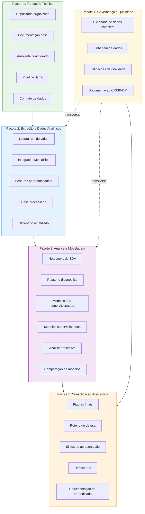
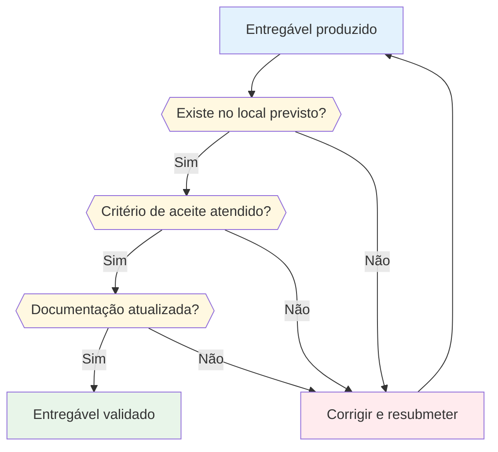
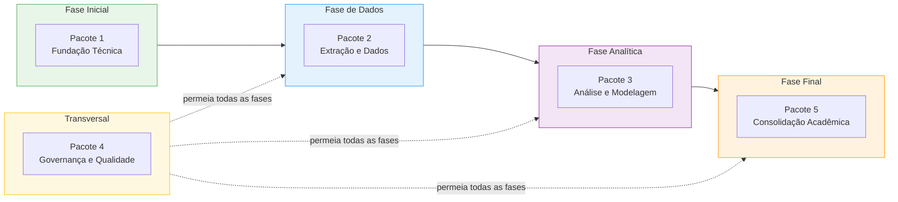

# Entregáveis do projeto

Este documento refina os entregáveis previstos para o projeto e organiza o que deve ser produzido, onde será armazenado e como cada item poderá ser validado. A matriz está alinhada ao [Cronograma do Projeto Integrador](CRONOGRAMA.md) e cobre todas as macro-fases previstas.

## Navegação

- [Início](../README.md)
- [Contribuição](../CONTRIBUTING.md)
- [Arquitetura](ARQUITETURA.md)
- [Cronograma](CRONOGRAMA.md)
- [Estratégia de dados e modelagem](ESTRATEGIA_DADOS_E_MODELAGEM.md)
- [Plano de execução](PLANO_DE_EXECUCAO.md)
- [Roadmap](ROADMAP.md)
- [Dicionário de dados](DICIONARIO_DE_DADOS.md)
- [Dados](../data/README.md)
- [Notebooks](../notebooks/README.md)
- [Relatórios](../reports/README.md)

## Objetivo deste documento

Padronizar a evolução do repositório para que o projeto avance com clareza técnica e coerência acadêmica, separando os artefatos por natureza e por etapa de maturidade.

---

## Matriz de entregáveis

### Estrutura e fundação

| Entregável | Descrição | Local previsto | Critério de aceite |
| --- | --- | --- | --- |
| Repositório organizado | Estrutura mínima com código, dados, notebooks, relatórios e documentação | Raiz do projeto | Pastas e arquivos coerentes com a pipeline |
| Documentação de projeto | Arquitetura, roadmap, plano de execução, cronograma, entregáveis | `docs/` | Documentos completos e navegáveis |
| Ambiente configurado | Python, venv, requirements.txt, ferramentas de dev | `.venv/`, `requirements.txt` | Ambiente reproduzível |

### Dados

| Entregável | Descrição | Local previsto | Critério de aceite |
| --- | --- | --- | --- |
| Base bruta | Vídeos e insumos originais autorizados | `data/raw/` | Arquivos identificados e documentados |
| Base intermediária | Saídas parciais da extração e preparação | `data/interim/` | Arquivos rastreáveis por etapa |
| Base processada | Features por frame e por janela | `data/processed/` | Dataset pronto para análise e modelagem |
| Rótulos | Classes e anotações de eventos | `data/labels/` | Convenção de rótulos documentada |

### Engenharia

| Entregável | Descrição | Local previsto | Critério de aceite |
| --- | --- | --- | --- |
| Pipeline de ingestão | Leitura e organização de vídeo | `src/mediapipe_seguranca/video_io.py` | Execução reproduzível |
| Extração visual | Camada de percepção com MediaPipe | `src/mediapipe_seguranca/mediapipe_extract.py` | Features visuais geradas com consistência |
| Feature engineering | Consolidação de atributos analíticos | `src/mediapipe_seguranca/feature_engineering.py` | Features úteis e documentadas |
| Pipeline orquestradora | Fluxo completo de dados | `src/mediapipe_seguranca/pipeline.py` | Pipeline executável end-to-end |

### Análise descritiva e exploratória

| Entregável | Descrição | Local previsto | Critério de aceite |
| --- | --- | --- | --- |
| EDA | Estatística descritiva, distribuição e correlação | `notebooks/` e `reports/eda/` | Visualizações e interpretação coerentes |
| Gráficos exploratórios | Heatmaps, boxplots, séries temporais | `reports/figures/` | Gráficos interpretáveis e reutilizáveis |
| Relatório EDA | Síntese dos achados descritivos | `reports/eda/` | Achados documentados com interpretação |

### Análise diagnóstica

| Entregável | Descrição | Local previsto | Critério de aceite |
| --- | --- | --- | --- |
| Relatório de causas | Investigação causal dos padrões encontrados | `reports/eda/` | Causas documentadas com evidências |
| Análise de impacto | Avaliação dos impactos dos fenômenos no contexto de segurança | `reports/eda/` | Impactos discutidos com contexto |
| Plano de ação | Recomendações para modelagem baseadas no diagnóstico | `reports/eda/` | Recomendações justificadas |

### Modelagem preditiva

| Entregável | Descrição | Local previsto | Critério de aceite |
| --- | --- | --- | --- |
| Não supervisionado | Clusterização e detecção de anomalias | `src/` e `reports/models/` | Resultados analisáveis e comparáveis |
| Supervisionado | Classificação de eventos rotulados | `src/` e `reports/models/` | Métricas e avaliação registradas |
| Comparação de modelos | Tabela comparativa entre abordagens | `reports/models/` | Comparação com métricas e interpretação |

### Análise prescritiva

| Entregável | Descrição | Local previsto | Critério de aceite |
| --- | --- | --- | --- |
| Recomendações baseadas em dados | Prescrições para o contexto de segurança | `reports/models/` | Recomendações viáveis e fundamentadas |
| Inferências consolidadas | Síntese de inferências dos modelos | `reports/defesa/` | Inferências conectadas aos resultados |
| Tomada de decisão | Conclusões e ações sugeridas | `reports/defesa/` | Decisões justificadas por dados |

### Governança e qualidade

| Entregável | Descrição | Local previsto | Critério de aceite |
| --- | --- | --- | --- |
| Dicionário de dados | Variáveis, tipos, escalas e granularidade | `docs/DICIONARIO_DE_DADOS.md` | Todas as variáveis documentadas |
| Linhagem de dados | Rastreabilidade raw - interim - processed | `docs/ARQUITETURA.md` | Fluxo de dados documentado e verificável |
| Qualidade de dados | Validações de completude, tipos e ranges | `notebooks/` e `reports/eda/` | Validações executadas e documentadas |
| Metodologia CRISP-DM | Documentação do ciclo CRISP-DM adaptado | `docs/PLANO_DE_EXECUCAO.md`, `docs/CRONOGRAMA.md` | Fases CRISP-DM mapeadas ao projeto |

### Comunicação e defesa

| Entregável | Descrição | Local previsto | Critério de aceite |
| --- | --- | --- | --- |
| Figuras finais | Gráficos, heatmaps e imagens de apoio selecionados | `reports/figures/` | Material reutilizável na defesa |
| Roteiro de defesa | Estrutura da apresentação oral | `reports/defesa/` | Roteiro com encadeamento lógico |
| Slides de apresentação | Material visual para defesa oral | `reports/defesa/` | Slides alinhados ao roteiro |
| Síntese de resultados | Narrativa técnica dos achados e conclusões | `reports/defesa/` | Narrativa alinhada ao projeto |
| Documentação de aprendizado | Registro de todo o processo de aprendizado | `docs/` | Documentação completa do processo |

---

## Diagrama de pacotes de entrega

Os entregáveis estão organizados em 5 pacotes de entrega, agrupando artefatos por natureza e maturidade.

## Fluxo de validação de entregáveis

O diagrama abaixo mostra como cada entregável é validado antes de seguir para o próximo pacote.

## Timeline de entregas

A sequência temporal abaixo mostra a ordem esperada de conclusão dos pacotes ao longo do projeto.

---

## Pacotes de entrega

### Pacote 1: fundação técnica

- estrutura inicial do repositório;
- pipeline base executável;
- contrato inicial de diretórios de dados;
- documentação de navegação do projeto;
- ambiente Python configurado e reproduzível;
- definição de problema, hipótese e objetivos.

### Pacote 2: extração e dados analíticos

- leitura real de vídeo;
- integração com MediaPipe;
- geração de features por frame e por janela;
- rastreamento dos arquivos gerados;
- base processada estável em `data/processed/`;
- dicionário de dados atualizado.

### Pacote 3: análise e modelagem

- notebooks de EDA com interpretação;
- análise estatística e visual completa;
- relatório de análise diagnóstica (causas e impactos);
- resultados não supervisionados (clusters, anomalias);
- resultados supervisionados (classificação, métricas);
- análise prescritiva (recomendações baseadas em dados);
- comparação entre abordagens com interpretação.

### Pacote 4: governança e qualidade

- dicionário de dados completo e atualizado;
- linhagem de dados documentada (raw - interim - processed);
- validações de qualidade executadas e registradas;
- documentação CRISP-DM mapeada ao projeto;
- versionamento e convenções de governança aplicadas.

### Pacote 5: consolidação acadêmica

- relatórios finais de interpretação;
- seleção de figuras para apresentação;
- roteiro de defesa oral;
- slides de apresentação;
- síntese dos achados, limitações e próximos passos;
- documentação de todo o processo de aprendizado.

---

## Critérios transversais

- **Organização**: cada artefato deve estar na pasta adequada.
- **Clareza**: nomes de arquivos devem indicar propósito e etapa.
- **Reprodutibilidade**: o caminho de geração do artefato deve ser identificável.
- **Consistência**: documentação e estrutura devem evoluir juntas.
- **Defensabilidade**: resultados precisam ser interpretáveis em contexto acadêmico.
- **Governança**: dados devem ter linhagem, dicionário e validação de qualidade.

## Prioridade atual

No momento, a prioridade recomendada é avançar nos seguintes itens:

1. formalizar o contrato de dados e rótulos;
2. integrar leitura real de vídeo;
3. substituir extração simulada por extração real com MediaPipe;
4. iniciar notebooks de EDA;
5. abrir a trilha de relatórios em `reports/`;
6. manter governança atualizada (dicionário, linhagem).

## Relação com outros documentos

- [Cronograma PI](CRONOGRAMA.md): mapeamento detalhado das atividades do PI.
- [Roadmap](ROADMAP.md): fases do projeto e dependências.
- [Plano de execução](PLANO_DE_EXECUCAO.md): etapas operacionais detalhadas.
- [Arquitetura](ARQUITETURA.md): camadas e módulos da pipeline.
- [Dicionário de dados](DICIONARIO_DE_DADOS.md): variáveis, tipos e granularidade.
