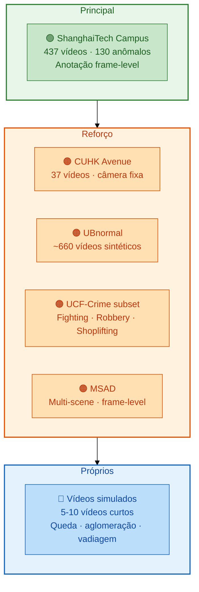
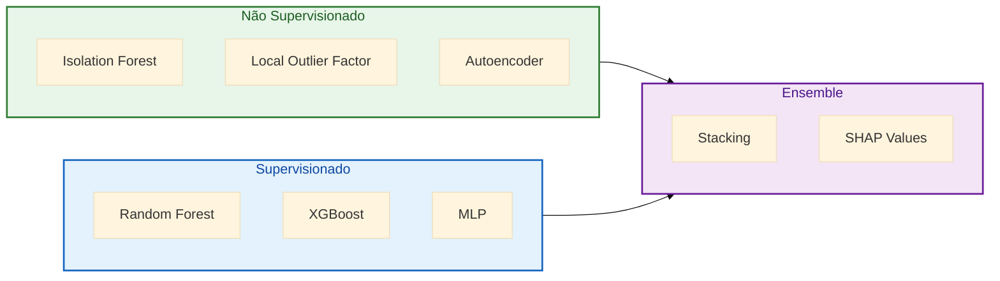

# Estratégia de dados e modelagem

Este documento registra a análise estratégica comparativa com o projeto LAVAD (ECCV 2024) e as decisões pendentes sobre datasets, features avançadas e estratégia de modelagem do projeto MediaPipe Segurança. Serve como referência para decisões do grupo e como argumentação técnica para a defesa acadêmica.

## Navegação

- [Início](../README.md)
- [Contribuição](../CONTRIBUTING.md)
- [Arquitetura](ARQUITETURA.md)
- [Cronograma](CRONOGRAMA.md)
- [Entregáveis](ENTREGAVEIS.md)
- [Plano de execução](PLANO_DE_EXECUCAO.md)
- [Roadmap](ROADMAP.md)
- [Dicionário de dados](DICIONARIO_DE_DADOS.md)
- [Dados](../data/README.md)
- [Notebooks](../notebooks/README.md)
- [Relatórios](../reports/README.md)

---

## 1. Análise comparativa com LAVAD

### O que é o LAVAD

**LAVAD** (*Language-grounded Video Anomaly Detection*) é um método publicado no ECCV 2024 por Zanella et al. que propõe uma pipeline zero-shot para detecção de anomalias em vídeo combinando modelos de visão-linguagem (VLM) e grandes modelos de linguagem (LLM). O sistema:

1. Amostra frames do vídeo a ~1 FPS
2. Gera descrições textuais de cada frame via VLM (ex.: LLaVA, Video-LLaVA)
3. Envia as descrições para um LLM (GPT-4) que classifica normalidade/anomalia
4. Produz scores de anomalia e justificativas em linguagem natural

### Pontos fortes do LAVAD

- **Zero-shot**: não requer treinamento específico ou dados anotados do domínio-alvo
- **Interpretabilidade textual**: produz justificativas em linguagem natural para cada decisão
- **Open-vocabulary**: capaz de detectar categorias de anomalias não vistas antes
- **Modularidade**: componentes VLM e LLM substituíveis por versões melhores

### Limitações críticas do LAVAD

| Limitação | Impacto |
|---|---|
| **Custo proibitivo** | Cada vídeo requer centenas de chamadas a API GPT-4 (~US$ 0.03/frame) |
| **Impossível em tempo real** | ~0.1 FPS — 300× mais lento que tempo real |
| **Bottleneck textual** | Descrições textuais perdem detalhes espaciais finos (posição, ângulos, distâncias) |
| **Alucinações do VLM** | Modelos de visão-linguagem descrevem objetos/eventos inexistentes |
| **Irreprodutibilidade** | Respostas do LLM variam entre execuções (temperatura, versão da API) |
| **Anomalias sutis** | Mudanças posturais leves ou padrões de marcha anormais são invisíveis ao VLM |
| **Dependência de internet** | Requer conectividade constante para chamadas de API |

### Como nosso projeto se diferencia

O projeto MediaPipe Segurança adota uma abordagem complementar e deliberadamente oposta em vários eixos:

- **MediaPipe em CPU**: extração de landmarks em tempo real sem GPU dedicada
- **30+ FPS**: processamento a taxa de vídeo real, viabilizando aplicação prática
- **Landmarks precisos**: coordenadas (x, y, z) de 33 pontos corporais por pessoa
- **Features numéricas objetivas**: ângulos, velocidades e distâncias mensuráveis — sem ambiguidade textual
- **Pipeline determinística**: mesma entrada gera mesma saída (seed fixo)
- **Tracking inter-frame**: rastreamento de identidades entre frames para features temporais

---

## 2. Estratégia de dados proposta (3 camadas)

A estratégia de dados segue um modelo de camadas progressivas, partindo de um benchmark consolidado e ampliando com fontes complementares.

### Camada 1 — Dataset principal: ShanghaiTech Campus

| Característica | Detalhe |
|---|---|
| **Vídeos** | 437 (307 treino + 130 teste com anomalias) |
| **Cenas anômalas** | 130 vídeos com anotação frame-level precisa |
| **Tipo de câmera** | Câmeras de segurança reais, nível do solo |
| **Resolução** | Pessoas claramente visíveis — compatível com MediaPipe |
| **Benchmark** | Top-3 mais comparado na literatura de VAD |
| **Anomalias** | Corrida, bicicleta em área proibida, brigas, vadiagem |

**Por que ShanghaiTech e não VIRAT?** O dataset VIRAT utiliza câmeras aéreas onde pessoas são representadas por ~20 pixels de altura, tornando impossível a extração de landmarks corporais via MediaPipe. ShanghaiTech oferece câmeras ao nível do solo com pessoas em tamanho suficiente para detecção de pose completa.

### Camada 2 — Datasets de reforço (a decidir)

| Dataset | Vídeos | Tipo | Vantagem | Limitação |
|---|---|---|---|---|
| **CUHK Avenue** | 37 | Real, câmera fixa | Anomalias de caminhada; excelente para MediaPipe | Escala pequena |
| **UBnormal** | ~660 | Sintético | Anotação pixel-level; controle total do cenário | Distribuição sintética |
| **UCF-Crime (subset)** | ~200 (subset) | Real, variado | Categorias violentas (Fighting, Robbery, Shoplifting) para comparar com SOTA | Anotação video-level apenas |
| **MSAD** | ~100 | Real, multi-cena | Frame-level, múltiplas câmeras | Menos citado na literatura |

### Camada 3 — Vídeos próprios/simulados

- **Quantidade**: 5 a 10 vídeos curtos (30-60 segundos cada)
- **Cenários**: queda proposital, aglomeração, vadiagem, corrida, objeto abandonado
- **Finalidade**: demonstração ao vivo na defesa e validação de edge cases
- **Requisitos**: câmera fixa, ambiente controlado, consentimento dos participantes

---

## 3. Features avançadas propostas

As features estão organizadas em três categorias que exploram diferentes dimensões do comportamento humano capturado por landmarks corporais.

### Features espaciais (por frame)

| Feature | Cálculo | Relevância |
|---|---|---|
| Ângulos articulares | Ângulo entre segmentos (cotovelo, joelho, ombro) via landmarks | Detecção de poses anômalas (queda, agressão) |
| Bounding box aspect ratio | Razão altura/largura do envelope da pessoa | Distingue pessoa em pé vs deitada |
| Área normalizada da bbox | Área da bbox / área do frame | Proximidade da câmera, relevância na cena |
| Distância entre pessoas | Distância euclidiana entre centróides de pessoas | Proxêmica — detecção de aglomeração ou invasão de espaço |
| Posição relativa no frame | (x, y) normalizados do centróide | Zona proibida, entrada/saída de área |

### Features temporais (por janela — diferencial crítico vs LAVAD)

| Feature | Cálculo | Relevância |
|---|---|---|
| Velocidade instantânea | Δ posição do centróide / Δt entre frames | Detecção de corrida, movimentos bruscos |
| Aceleração | Derivada segunda da posição | Mudanças abruptas de velocidade |
| Jerk | Derivada terceira da posição (variação da aceleração) | Identificação de movimentos bruscos e erráticos |
| Curvatura da trajetória | Razão distância percorrida / deslocamento | Trajetórias erráticas vs lineares |
| Dwell time por zona | Tempo acumulado em região definida | Vadiagem, permanência suspeita |
| Movement entropy (Shannon) | Entropia da distribuição direcional do movimento | Aleatoriedade do movimento — alta entropia = errático |

### Features comportamentais (inovação)

| Feature | Cálculo | Relevância |
|---|---|---|
| Posture stability index | Variância dos ângulos articulares em janela temporal | Instabilidade corporal — queda, embriaguez |
| Gait regularity | Autocorrelação do padrão de marcha (ciclo de passada) | Marcha irregular = potencial anomalia |
| Interaction proximity | Padrão temporal de aproximação entre duas pessoas | Interação agressiva vs casual |
| Scene occupancy dynamics | Taxa de mudança da contagem de pessoas por zona | Aglomeração/dispersão súbita |

---

## 4. Modelagem em 3 níveis

A estratégia de modelagem é progressiva: começa sem rótulos (não supervisionado), incorpora rótulos quando disponíveis (supervisionado) e combina modelos com explicabilidade (ensemble).

| Nível | Método | Finalidade | Dados necessários |
|---|---|---|---|
| **1. Não supervisionado** | Isolation Forest + LOF + Autoencoder | Baseline sem labels — detecção de outliers | Apenas features (sem rótulos) |
| **2. Supervisionado** | Random Forest + XGBoost + MLP | Classificação quando labels disponíveis | Features + rótulos frame-level |
| **3. Ensemble + Explicabilidade** | Stacking + SHAP values | Combina modelos e explica decisões | Predições dos níveis 1 e 2 |

### Justificativa da progressão

- **Nível 1** permite iniciar a modelagem imediatamente com ShanghaiTech (treino = vídeos normais)
- **Nível 2** entra quando rótulos estiverem mapeados nos datasets
- **Nível 3** agrega os resultados e fornece material de interpretabilidade para a defesa

---

## 5. Interpretabilidade (diferencial vs LAVAD)

A interpretabilidade é um dos diferenciais estratégicos do projeto em relação ao LAVAD, que depende de texto genérico gerado por LLM.

| Técnica | O que revela | Uso na defesa |
|---|---|---|
| **SHAP values** | Contribuição de cada feature para cada predição individual | Gráficos de waterfall e beeswarm por tipo de anomalia |
| **Regras de árvores de decisão** | Regras if-then derivadas dos modelos de árvore | Regras interpretáveis para operadores de segurança |
| **Mapas de calor temporais** | Concentração de anomalias ao longo do tempo | Padrões temporais de risco |
| **Feature importance** | Ranking global das features mais relevantes por modelo | Comparação entre modelos e validação do domínio |

### Vantagem sobre LAVAD

- LAVAD produz justificativas textuais genéricas e não reproduzíveis (ex.: "a person is running suspiciously")
- Nosso projeto produz evidências quantitativas rastreáveis (ex.: "velocidade do centróide = 2.3 m/s, SHAP = +0.45")

---

## 6. Tabela comparativa final — Nosso Projeto vs LAVAD

| Dimensão | LAVAD (ECCV 2024) | Nosso Projeto |
|---|---|---|
| **Custo operacional** | Alto (API GPT-4, ~US$ 0.03/frame) | Grátis (CPU, open-source) |
| **Tempo real** | Impossível (~0.1 FPS) | Viável (30+ FPS com MediaPipe) |
| **Reprodutibilidade** | Parcial (LLM não-determinístico) | Total (seed fixo, pipeline determinística) |
| **Precisão espacial** | Perdida no bottleneck textual | Landmarks com coordenadas pixel (33 pontos × 3D) |
| **Explicabilidade** | Texto genérico do LLM | SHAP values + feature importance quantitativa |
| **Features temporais** | Limitadas (~1 frame/segundo) | Ricas (30 FPS, tracking inter-frame, derivadas) |
| **Hardware mínimo** | GPU 16 GB + API paga + internet | Laptop com CPU |
| **Dependência externa** | API proprietária (OpenAI) | Nenhuma (tudo local) |
| **Treinamento necessário** | Nenhum (zero-shot) | Sim (supervisionado requer labels) |
| **Open-vocabulary** | Sim (detecta categorias novas) | Não (limitado às features definidas) |
| **Anomalias sutis** | Fraco (VLM perde detalhes finos) | Forte (landmarks captam variações posturais) |

> **Nota estratégica**: o LAVAD e nosso projeto não são concorrentes — são abordagens complementares. A narrativa na defesa deve posicionar nosso projeto como uma alternativa prática, reproduzível e de baixo custo para cenários onde tempo real e precisão espacial são prioritários.

---

## 7. Decisões pendentes para o operador

As decisões abaixo devem ser revisadas e confirmadas pelo grupo antes de avançar para as fases de implementação correspondentes.

### Dados

- [ ] Confirmar **ShanghaiTech Campus** como dataset principal
- [ ] Escolher dataset(s) de reforço (marcar os selecionados):
  - [ ] CUHK Avenue
  - [ ] UBnormal
  - [ ] UCF-Crime (subset: Fighting, Robbery, Shoplifting)
  - [ ] MSAD
- [ ] Planejar gravação de **vídeos próprios/simulados** (cenários, local, participantes)

### Features

- [ ] Confirmar escopo de **features temporais avançadas** (jerk, curvatura, entropy)
- [ ] Confirmar escopo de **features comportamentais** (gait regularity, interaction proximity)

### Modelagem

- [ ] Confirmar **modelagem em 3 níveis** ou simplificar (ex.: apenas níveis 1 e 2)
- [ ] Confirmar uso de **SHAP/LIME** para interpretabilidade

### Defesa

- [ ] Confirmar **narrativa comparativa com LAVAD** na apresentação de defesa
- [ ] Definir se LAVAD será citado como trabalho relacionado ou como contraponto direto

---

## Histórico de atualizações

| Data | Mudança |
|---|---|
| 2026-03-28 | Criação do documento com análise comparativa LAVAD, estratégia de dados, features e modelagem |
