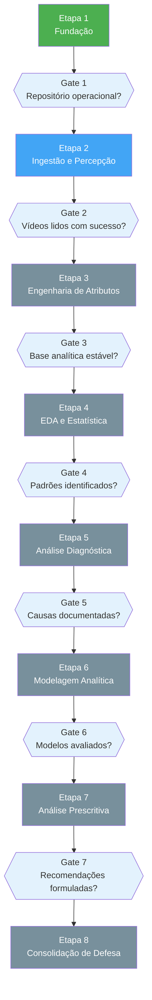
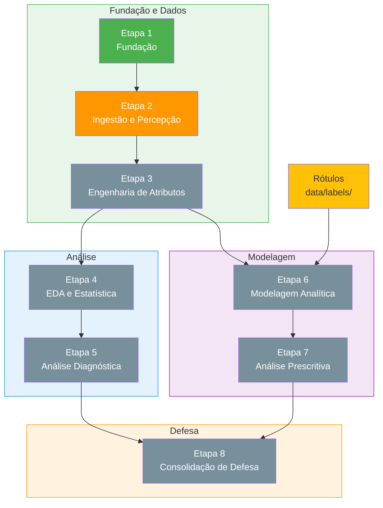

# Plano de execução

Este documento organiza o desenvolvimento do projeto em etapas práticas, conectando implementação, análise e material de apresentação. As etapas estão alinhadas ao [Cronograma do Projeto Integrador](CRONOGRAMA.md) e à metodologia CRISP-DM adaptada ao contexto acadêmico.

## Navegação

- [Início](../README.md)
- [Contribuição](../CONTRIBUTING.md)
- [Arquitetura](ARQUITETURA.md)
- [Cronograma](CRONOGRAMA.md)
- [Entregáveis](ENTREGAVEIS.md)
- [Roadmap](ROADMAP.md)
- [Dicionário de dados](DICIONARIO_DE_DADOS.md)
- [Dados](../data/README.md)
- [Notebooks](../notebooks/README.md)
- [Relatórios](../reports/README.md)

---

## Visão geral das etapas

O plano de execução está organizado em 8 etapas que cobrem as 8 macro-fases do Cronograma PI e as fases do CRISP-DM.

### Diagrama de fluxo de execução

O fluxo abaixo mostra a sequência de etapas com gates de validação entre elas. Cada gate verifica se as saídas mínimas da etapa anterior estão concluídas antes de avançar.



### Diagrama de dependências

O diagrama abaixo mostra as dependências entre etapas, incluindo dependências paralelas e convergências.



### Mapeamento etapas vs. cronograma PI

| Etapa | Macro-fase do cronograma PI | Fase CRISP-DM |
| --- | --- | --- |
| Etapa 1 — Fundação | 1. Definição + 2. Setup Infra | Entendimento do Negócio |
| Etapa 2 — Ingestão e Percepção | 3. Pré-Processamento (Ingestão) | Entendimento dos Dados |
| Etapa 3 — Engenharia de Atributos | 3. Pré-Processamento (Tratamento, Pipeline, Governança) | Preparação dos Dados |
| Etapa 4 — EDA e Estatística | 4. Análise Descritiva/Exploratória | Preparação dos Dados / Modelagem |
| Etapa 5 — Análise Diagnóstica | 5. Análise Diagnóstica | Avaliação |
| Etapa 6 — Modelagem Analítica | 6. Análise Preditiva | Modelagem |
| Etapa 7 — Análise Prescritiva | 7. Análise Prescritiva | Avaliação / Implantação |
| Etapa 8 — Consolidação de Defesa | 8. Construção da Apresentação Final | Implantação / Defesa |

---

## Etapa 1: fundação

**Objetivo**: garantir uma base organizada, executável e com todas as definições necessárias para o projeto.

**Alinha com**: Cronograma PI — Seção 1 (Definição), atividades 4-30 + Seção 2 (Setup Infra), atividades 33-40
**Fases do roadmap**: Fase 1

### Itens de trabalho

- definir problema, hipótese e objetivos do projeto;
- definir ferramentas, arquitetura e metodologia (CRISP-DM);
- criar estrutura do repositório com diretórios padronizados;
- configurar ambiente Python (venv, requirements.txt);
- implementar pipeline demo executável;
- documentar entregáveis, arquitetura, dicionário de dados;
- definir estratégia de gerenciamento (GitHub Issues/Projects);
- definir governança básica: dicionário de dados, versionamento, convenções.

### Checklist de validação

| Item | Evidência esperada | Status |
| --- | --- | --- |
| Estrutura de diretórios | Pastas `data/`, `src/`, `notebooks/`, `reports/`, `docs/`, `tests/` criadas | Concluído |
| README consolidado | `README.md` com visão geral do projeto | Concluído |
| Package Python | `src/mediapipe_seguranca/` com `__init__.py` | Concluído |
| Pipeline demo | `main.py` executável sem erros | Concluído |
| Teste básico | `tests/test_pipeline.py` passando | Concluído |
| Documentação base | `docs/ARQUITETURA.md`, `ENTREGAVEIS.md`, `PLANO_DE_EXECUCAO.md`, `ROADMAP.md`, `CRONOGRAMA.md` | Concluído |
| Dicionário de dados | `docs/DICIONARIO_DE_DADOS.md` com variáveis iniciais | Concluído |
| Ambiente configurado | `requirements.txt` com dependências, `.venv/` funcional | Concluído |

---

## Etapa 2: ingestão e percepção

**Objetivo**: sair da simulação e entrar na leitura real de vídeo, integrando os detectores do MediaPipe.

**Alinha com**: Cronograma PI — Seção 3 (Pré-Processamento), atividades 49, 55, 58-60 (Ingestão) e 69-77 (Tratamento)
**Fases do roadmap**: Fase 2 + Fase 3

### Itens de trabalho

- definir formato e protocolo dos vídeos de entrada;
- implementar leitura real de vídeo quadro a quadro;
- definir volumetria e estratégia de amostragem;
- integrar tarefas reais do MediaPipe (detecção de pose, landmarks);
- validar detecção de pessoas e sinais visuais;
- salvar saídas intermediárias com rastreabilidade;
- documentar estrutura de colunas intermediária.

### Checklist de validação

| Item | Evidência esperada | Status |
| --- | --- | --- |
| Vídeos de teste | Amostras em `data/raw/shanghaitech/` (real local + `SAMPLE/`) com metadados documentados | Concluído (Fase 2) |
| Leitura de vídeo | `shanghaitech_loader.py` + `video_io.py` lendo vídeos reais sem erros | Concluído (Fase 2) |
| Integração MediaPipe | [mediapipe_extract.py](../src/mediapipe_seguranca/mediapipe_extract.py) extraindo sinais reais de pose (Pose Landmarker + fallback Object Detector) | Concluído (Fase 3, 2026-04-25) |
| Saídas intermediárias | Arquivos em `data/interim/mediapipe_frames/{split}/{video_id}.parquet` + `_manifest.parquet` | Concluído (Fase 3, 2026-04-25) |
| Notebook de ingestão | Notebook `01_ingestao` executável | Planejado |
| Notebook de extração | [notebooks/02_extracao_mediapipe.md](../notebooks/02_extracao_mediapipe.md) executável (4 figuras em `reports/figures/fase3_*.png`) | Concluído (Fase 3, 2026-04-25) |
| Documentação de colunas | Estrutura de colunas documentada em [DICIONARIO_DE_DADOS.md](DICIONARIO_DE_DADOS.md#saídas-da-extração-mediapipe-fase-3) | Concluído (Fase 3, 2026-04-25) |

### Comandos operacionais validados (Fase 3)

```powershell
# 1. Baixar modelos MediaPipe (uma vez)
python scripts/download_mediapipe_models.py

# 2. Executar pipeline real (extração + features por janela)
python main.py --mode real --split training --limit-videos 2 --frame-stride 5
```

Saídas esperadas:

- `data/interim/mediapipe_frames/training/<video_id>.parquet`
- `data/interim/mediapipe_frames/training/_manifest.parquet`
- `data/processed/window_features_real.csv`
- Relatório de validação: [reports/eda/fase3_validacao_mediapipe.md](../reports/eda/fase3_validacao_mediapipe.md)

### Pendências e ressalvas registradas (Fase 3)

- ⚠️ **Detecções zeradas no SAMPLE/training**: nos vídeos do SAMPLE de treino, pessoas pequenas/distantes para o `pose_landmarker_lite` resultaram em `num_people_detected = 0` em todos os frames processados. Recomendação para iteração futura (Fase 4): rodar com `--split testing` (cenas com pessoas mais próximas) e/ou substituir por `pose_landmarker_full.task` para validar a sensibilidade do detector antes da consolidação da base analítica.

### Checkpoints operacionais de dados e escopo

| Gate | Objetivo | Evidência esperada | Status |
| --- | --- | --- | --- |
| Gate D1 — Dataset principal | Manter ShanghaiTech Campus como base da execução | Ingestão local validada e documentação sincronizada | Concluído |
| Gate D2 — Datasets de reforço | Formalizar seleção de datasets adicionais (se houver) | Registro explícito da seleção no roadmap/plano | Planejado |
| Gate D3 — Vídeos próprios/simulados | Definir escopo para material de defesa (se aplicável) | Registro de cenários e finalidade acadêmica | Planejado |
| Gate F1 — Features avançadas | Priorizar backlog de features avançadas para Fase 4 | Backlog marcado no dicionário de dados | Planejado |

---

## Etapa 3: engenharia de atributos

**Objetivo**: transformar sinais visuais em variáveis úteis para análise, consolidando a base analítica.

**Alinha com**: Cronograma PI — Seção 3 (Pré-Processamento), atividades 72-77 (Tratamento), 80-83 (Processamento), 86-88 (Pipeline), 91-95 (Governança)
**Fases do roadmap**: Fase 4

### Itens de trabalho

- consolidar atributos por frame a partir dos sinais do MediaPipe;
- agregar atributos por janela temporal;
- implementar limpeza, integração e transformação de dados;
- definir e documentar variáveis e escalas no dicionário;
- estabilizar a base para EDA e modelagem;
- garantir governança: linhagem rastreável, qualidade verificável;
- revisar consistência dos dados com validações automáticas.

### Checklist de validação

| Item | Evidência esperada | Status |
| --- | --- | --- |
| Features por frame | [feature_engineering_real.py](../src/mediapipe_seguranca/feature_engineering_real.py) gerando `frame_features_real` (`FRAME_FEATURES_SCHEMA`, 14 colunas + linhagem) | Concluído (Fase 4, 2026-04-25) |
| Features por janela | `aggregate_window_features_real` produzindo `window_features_real` (`WINDOW_FEATURES_SCHEMA`, janela default 15 frames) | Concluído (Fase 4, 2026-04-25) |
| Base processada | [data/processed/frame_features_real.{parquet,csv}](../data/processed/frame_features_real.csv) e [window_features_real.{parquet,csv}](../data/processed/window_features_real.csv) prontos para análise | Concluído (Fase 4, 2026-04-25) |
| Notebook de features | [notebooks/03_feature_engineering.md](../notebooks/03_feature_engineering.md) executável com 4 figuras em `reports/figures/fase4_*.png` | Concluído (Fase 4, 2026-04-25) |
| Dicionário atualizado | [docs/DICIONARIO_DE_DADOS.md](DICIONARIO_DE_DADOS.md#base-analítica-consolidada-fase-4) com `FRAME_FEATURES_SCHEMA`, `WINDOW_FEATURES_SCHEMA` e linhagem | Concluído (Fase 4, 2026-04-25) |
| Pipeline integrada | [pipeline.py](../src/mediapipe_seguranca/pipeline.py) com `run_processed_base_pipeline` e CLI `--mode processed --window-size` | Concluído (Fase 4, 2026-04-25) |
| Qualidade de dados | [data/processed/data_quality_report.json](../data/processed/data_quality_report.json) gerado por `compute_quality_report` (`pipeline_version=fase4-v1`) | Concluído (Fase 4, 2026-04-25) |
| Suite de testes | 6 testes em [tests/test_feature_engineering_real.py](../tests/test_feature_engineering_real.py) + ajustes em [tests/test_pipeline.py](../tests/test_pipeline.py) e [tests/test_mediapipe_extract.py](../tests/test_mediapipe_extract.py) — suite total 15 passed | Concluído (Fase 4, 2026-04-25) |

### Comandos operacionais validados (Fase 4)

```powershell
# Construir a base analítica consolidada a partir das saídas da Fase 3
python main.py --mode processed

# Customizar o tamanho da janela temporal (default = 15 frames)
python main.py --mode processed --window-size 15
```

Saídas esperadas:

- `data/processed/frame_features_real.parquet` e `frame_features_real.csv`
- `data/processed/window_features_real.parquet` e `window_features_real.csv`
- `data/processed/data_quality_report.json` (`pipeline_version=fase4-v1`)
- Relatório de validação: [reports/eda/fase4_validacao_base_processada.md](../reports/eda/fase4_validacao_base_processada.md)

### Pendências e ressalvas registradas (Fase 4)

- ⚠️ **SAMPLE/training com detecção zerada**: a base processada gerada na Fase 4 herda a limitação da Fase 3 — `num_people_detected = 0` em todos os frames do SAMPLE/training. Não é regressão: o pipeline está pronto para escalar. Recomendação antes da Fase 5 entregar EDA com peso analítico real: rodar a extração (Fase 3) com dataset expandido (`--split testing`) e/ou substituir por `pose_landmarker_full.task`, depois reexecutar `python main.py --mode processed`.

---

## Etapa 4: EDA e estatística

**Objetivo**: entender comportamento, distribuição e padrões iniciais dos dados preparados.

**Alinha com**: Cronograma PI — Seção 4 (Análise Descritiva/Exploratória), atividades 106-118
**Fases do roadmap**: Fase 5

### Itens de trabalho

- calcular estatística descritiva: média, mediana, moda, desvio padrão, variância;
- analisar distribuição de frequência e classes;
- calcular medidas de posição relativa (percentis, quartis);
- analisar correlação e associação entre atributos;
- identificar e tratar outliers e valores ausentes;
- produzir gráficos temporais e de distribuição;
- gerar visualizações para a banca (heatmaps, boxplots, séries temporais);
- sintetizar achados em relatório interpretativo.

### Checklist de validação

| Item | Evidência esperada | Status |
| --- | --- | --- |
| Estatística descritiva | Medidas resumo calculadas para todas as variáveis | Planejado |
| Análise de correlação | Matriz de correlação e heatmap gerados | Planejado |
| Outliers e missing | Análise de valores atípicos e ausentes documentada | Planejado |
| Notebook de EDA | Notebook `04_eda` executável com interpretações | Planejado |
| Gráficos salvos | Figuras em `reports/figures/` reutilizáveis | Planejado |
| Relatório de EDA | Síntese em `reports/eda/` com achados principais | Planejado |
| Recomendações | Indicações para modelagem baseadas na EDA | Planejado |

---

## Etapa 5: análise diagnóstica

**Objetivo**: investigar causas dos padrões encontrados na EDA e formular plano de ação para modelagem.

**Alinha com**: Cronograma PI — Seção 5 (Análise Diagnóstica), atividades 122-125
**Fases do roadmap**: Fase 5b

### Itens de trabalho

- investigar causas dos fenômenos observados nos dados;
- analisar impactos dos padrões identificados no contexto de segurança;
- documentar desafios entre dados reais e dados observados;
- identificar limitações e vieses dos dados;
- formular plano de ação e recomendações para as fases de modelagem.

### Checklist de validação

| Item | Evidência esperada | Status |
| --- | --- | --- |
| Análise causal | Investigação de causas integrada à EDA | Planejado |
| Análise de impacto | Discussão dos impactos dos padrões observados | Planejado |
| Limitações documentadas | Vieses e restrições dos dados registrados | Planejado |
| Plano de ação | Recomendações para modelagem documentadas em `reports/eda/` | Planejado |
| Relatório diagnóstico | Seção de diagnóstico em `reports/eda/` | Planejado |

---

## Etapa 6: modelagem analítica

**Objetivo**: comparar abordagens supervisionadas e não supervisionadas para detecção de padrões e classificação de eventos.

**Alinha com**: Cronograma PI — Seção 6 (Análise Preditiva), atividades 130-141
**Fases do roadmap**: Fase 6 + Fase 7

### Itens de trabalho

- definir abordagens de IA por níveis (não supervisionado, supervisionado e combinação);
- treinar modelos não supervisionados (perfis de cena, anomalias);
- treinar modelos supervisionados com eventos rotulados;
- avaliar a viabilidade de combinação dos níveis com interpretabilidade;
- validar balanceamento de classes e tratar viés;
- ajustar hiperparâmetros e otimizar modelos;
- calcular métricas de avaliação (acurácia, precision, recall, F1, silhouette);
- gerar matrizes de confusão e gráficos de comparação;
- analisar erros e limitações dos modelos;
- comparar desempenho entre abordagens.

### Checklist de validação

| Item | Evidência esperada | Status |
| --- | --- | --- |
| Modelos não supervisionados | Clusterização executada e interpretada | Planejado |
| Modelos supervisionados | Classificação treinada e avaliada | Planejado |
| Rótulos disponíveis | Anotações em `data/labels/` com convenção documentada | Planejado |
| Métricas registradas | Métricas de cada modelo salvas em `reports/models/` | Planejado |
| Notebook não supervisionado | Notebook `05_unsupervised` executável | Planejado |
| Notebook supervisionado | Notebook `06_supervised` executável | Planejado |
| Comparação de modelos | Tabela comparativa em `reports/models/` | Planejado |
| Análise de erros | Discussão de limitações e erros dos modelos | Planejado |
| Nível 3 (combinação) avaliado | Critério para combinação entre níveis documentado | Planejado |

### Estratégia oficial de modelagem por níveis

| Nível | Escopo operacional | Pré-condição |
| --- | --- | --- |
| Nível 1 — Não supervisionado | Detectar padrões e outliers sem rótulos | Base processada estável |
| Nível 2 — Supervisionado | Classificar eventos com rótulos | Convenção de rótulos consolidada |
| Nível 3 — Combinação + interpretabilidade | Combinar resultados dos níveis 1 e 2 quando comparáveis | Métricas dos níveis anteriores disponíveis |

---

## Etapa 7: análise prescritiva

**Objetivo**: interpretar resultados dos modelos preditivos e formular recomendações baseadas em dados para o contexto de segurança.

**Alinha com**: Cronograma PI — Seção 7 (Análise Prescritiva), atividades 148-153
**Fases do roadmap**: Fase 7b

### Itens de trabalho

- interpretar resultados dos modelos preditivos em contexto de segurança;
- avaliar resolubilidade e viabilidade das recomendações;
- formular prescrições baseadas em dados (ações sugeridas);
- consolidar inferências e conclusões para a defesa;
- documentar resultado final e tomada de decisão baseada em dados.

### Checklist de validação

| Item | Evidência esperada | Status |
| --- | --- | --- |
| Estudo de resultados | Análise de resultados preditivos em `reports/models/` | Planejado |
| Recomendações formuladas | Prescrições documentadas com base em dados | Planejado |
| Inferências consolidadas | Síntese de inferências em `reports/defesa/` | Planejado |
| Notebook de visualizações | Notebook `07_visualizacoes` com resultados finais | Planejado |
| Tomada de decisão | Conclusões e recomendações finais documentadas | Planejado |

---

## Etapa 8: consolidação de defesa

**Objetivo**: transformar resultados em narrativa acadêmica e preparar todo o material para defesa oral do projeto.

**Alinha com**: Cronograma PI — Seção 8 (Construção da Apresentação Final), atividades 159-163
**Fases do roadmap**: Fase 8

### Itens de trabalho

- selecionar figuras-chave para a apresentação;
- organizar achados principais em narrativa coerente;
- registrar limitações e riscos metodológicos;
- garantir qualidade do código (linting, formatação, testes);
- verificar organização final do repositório;
- montar roteiro de defesa oral;
- estruturar slides de apresentação;
- documentar todo o processo de aprendizado.

### Checklist de validação

| Item | Evidência esperada | Status |
| --- | --- | --- |
| Figuras finais | Gráficos selecionados em `reports/figures/` | Planejado |
| Roteiro de defesa | Roteiro em `reports/defesa/` | Planejado |
| Slides | Estrutura de apresentação em `reports/defesa/` | Planejado |
| Qualidade de código | Linting (ruff), formatação (black/isort), testes (pytest) aprovados | Planejado |
| Repositório organizado | Estrutura limpa e navegável | Planejado |
| Narrativa técnica | Encadeamento hipótese-método-resultado-conclusão | Planejado |
| Documentação completa | Todos os docs atualizados e coerentes | Planejado |
| Limitações registradas | Seção de limitações e próximos passos documentada | Planejado |

---

## Requisito transversal: interpretabilidade

A interpretabilidade é tratada como requisito transversal nas etapas analíticas e de modelagem. Sempre que houver resultado de modelo, a evidência deve incluir explicação técnica rastreável (por exemplo: importância de variáveis, regras extraídas ou análise de contribuição por feature), respeitando o estágio de maturidade de cada etapa.

## Definição de pronto por frente

- **Código**: executa sem ajustes manuais fora do fluxo documentado.
- **Dados**: possuem origem e etapa identificáveis.
- **Análise**: contém explicação, não apenas gráfico ou métrica.
- **Modelagem**: registra critérios de avaliação e interpretação.
- **Governança**: dicionário atualizado, linhagem rastreável, qualidade verificável.
- **Defesa**: conecta resultados ao objetivo do projeto.

## Relação com outros documentos

- [Cronograma PI](CRONOGRAMA.md): mapeamento detalhado das atividades do PI.
- [Roadmap](ROADMAP.md): fases do projeto e dependências.
- [Entregáveis](ENTREGAVEIS.md): matriz de artefatos e critérios de aceite.
- [Arquitetura](ARQUITETURA.md): camadas e módulos da pipeline.
- [Dicionário de dados](DICIONARIO_DE_DADOS.md): variáveis, tipos e granularidade.
