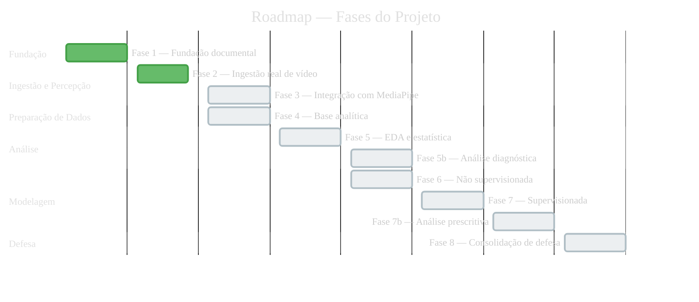
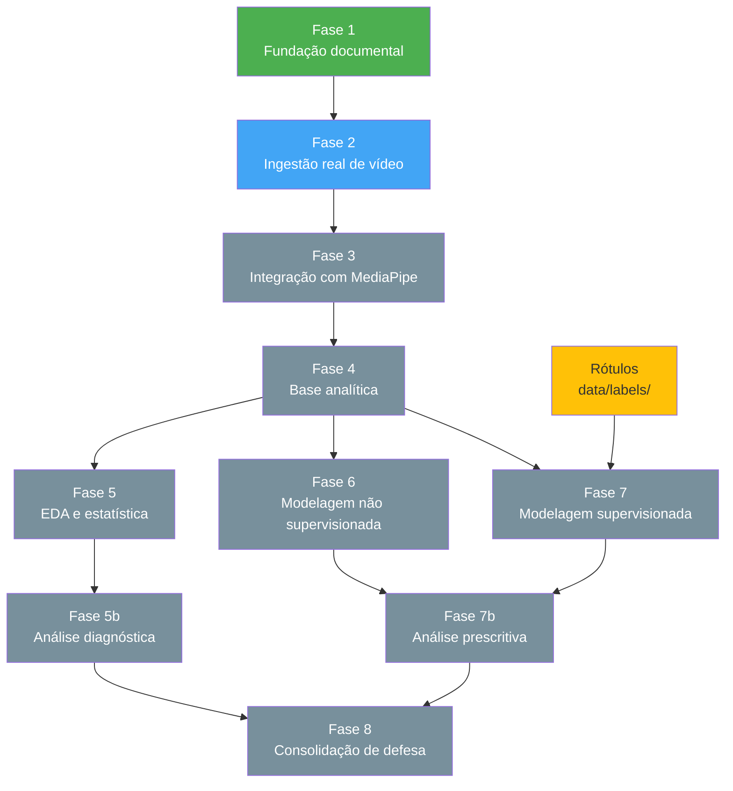

# Roadmap do projeto

Este documento organiza a evolução do projeto em fases, marcos e dependências, conectando planejamento técnico, entregáveis acadêmicos e prioridades de implementação.

## Navegação

- [Início](../README.md)
- [Contribuição](../CONTRIBUTING.md)
- [Arquitetura](ARQUITETURA.md)
- [Cronograma](CRONOGRAMA.md)
- [Entregáveis](ENTREGAVEIS.md)
- [Estratégia de dados e modelagem](ESTRATEGIA_DADOS_E_MODELAGEM.md)
- [Plano de execução](PLANO_DE_EXECUCAO.md)
- [Roadmap](ROADMAP.md)
- [Dicionário de dados](DICIONARIO_DE_DADOS.md)
- [Dados](../data/README.md)
- [Notebooks](../notebooks/README.md)
- [Relatórios](../reports/README.md)

## Objetivo

Servir como visão executiva do progresso esperado do projeto, deixando claro:

- o que já está estruturado;
- o que vem a seguir;
- quais entregas dependem de outras;
- quais marcos são mais importantes para a defesa acadêmica.

O roadmap está alinhado ao [Cronograma do Projeto Integrador](CRONOGRAMA.md), que detalha todas as atividades previstas pela PUC e o mapeamento com o repositório.

## Estado atual

No momento, o projeto já possui:

- estrutura base do repositório em Python;
- pipeline demo executável;
- testes mínimos para a base inicial;
- documentação de arquitetura, entregáveis, dados, notebooks e relatórios;
- contrato inicial de organização do trabalho acadêmico e técnico.

## Visão temporal das fases



## Grafo de dependências entre fases



## Fases do roadmap

### Fase 1: fundação documental e estrutural

**Status**: concluída
**Cronograma PI**: cobre seções 1 (Definição) e 2 (Setup Infra)

#### Objetivos

- consolidar a estrutura do repositório;
- registrar convenções de organização;
- documentar entregáveis, arquitetura e dicionário de dados;
- criar base inicial executável;
- definir ferramentas, metodologia e governança básica.

#### Principais saídas

- `README.md`
- `CONTRIBUTING.md`
- `docs/ENTREGAVEIS.md`
- `docs/PLANO_DE_EXECUCAO.md`
- `docs/ARQUITETURA.md`
- `docs/DICIONARIO_DE_DADOS.md`
- `docs/CRONOGRAMA.md`
- estrutura de `data/`, `notebooks/`, `reports/`, `src/` e `tests/`

### Fase 2: ingestão real de vídeo

**Status**: concluída
**Cronograma PI**: cobre atividades 49, 55, 58-60 (Pré-Processamento — Ingestão)

#### Objetivos

- substituir a ingestão sintética por leitura real de vídeo;
- validar formato, duração e metadados das amostras;
- definir estratégia de amostragem e janelamento.

#### Dependências

- disponibilidade local do dataset real extraído em `data/raw/shanghaitech/` ou uso do `SAMPLE/` versionado;
- definição mínima de protocolo de entrada.

#### Progresso atual (2026-03-28)

- ✅ **Dataset principal selecionado**: ShanghaiTech Campus (330 treino, 109 teste, 109 GT masks no dataset real)
  - Estratégia documentada em `docs/ESTRATEGIA_DADOS_E_MODELAGEM.md`
- ✅ **Estrutura de diretórios criada**: `data/raw/shanghaitech/` com suporte a `training/` e `testing/` locais e `SAMPLE/` versionado
- ✅ **Mini-dataset sintético**: `data/raw/shanghaitech/SAMPLE/` — 5 vídeos treino × 50 frames, 2 vídeos teste × 30 frames, 2 GT masks `.npy` (310 frames total)
- ✅ **Loader implementado**: `src/mediapipe_seguranca/shanghaitech_loader.py` — `get_train_videos()`, `get_test_videos_with_gt()`, `load_gt_mask()`, `iter_frames()`
- ✅ **Script de download**: `scripts/download_shanghaitech.py` — apoio ao processo de obtenção, sujeito à disponibilidade das fontes externas
- ✅ **Script de validação**: `scripts/validate_shanghaitech.py` — relatório de status do dataset
- ✅ **Script de geração sintética**: `scripts/create_sample_shanghaitech.py`
- ✅ **Link oficial do dataset**: OneDrive SVIP Lab — `https://1drv.ms/u/s!AjjUqiJZsj8whLt-1ABerTT-9eH9Ag?e=eJbY6Y`
- ⚠️ **Dataset real não baixado**: requer download manual (~20 GB) — ver `data/raw/shanghaitech/DOWNLOAD_INSTRUCTIONS.md`

**Pipeline pode executar com `SAMPLE/` imediatamente. Para uso do dataset real, o download e a extração devem ser feitos localmente.**

#### Fase 2 Concluída

**Data de conclusão**: 2026-03-28

**Artefatos principais**:

- ✅ **Ingestão ShanghaiTech Campus validada**: pipeline e processo de ingestão validados com dataset real em ambiente local (330 vídeos treino, 109 vídeos teste, 109 GT masks)
- ✅ **Scripts de download e validação**: `download_shanghaitech.py`, `validate_shanghaitech.py`, `create_sample_shanghaitech.py`
- ✅ **Loader integrado**: `shanghaitech_loader.py` com métodos `get_train_videos()`, `get_test_videos_with_gt()`, `load_gt_mask()`, `iter_frames()`
- ✅ **Documentação completa**: `DOWNLOAD_INSTRUCTIONS.md`, `DOWNLOAD_STATUS.md`, `DATASET_GUIDE.md`
- ✅ **Armazenamento de dados**: estratégia documentada para download oficial e uso local; repositório mantém apenas `SAMPLE/` e documentação leve

**Método de ingestão**: OpenCV AVI → JPEG frames (640×480, índices sequenciais)

**Status**: READY FOR FASE 3 — Integração com MediaPipe

#### Principais saídas

- rotina real de leitura de vídeo;
- metadados por frame ou segmento;
- documentação do formato de entrada;
- notebook de ingestão executável.

### Fase 3: integração com MediaPipe

**Status**: planejada
**Cronograma PI**: cobre atividades 69-77 (Pré-Processamento — Tratamento)

#### Objetivos

- integrar tarefas reais do MediaPipe;
- validar detecção de pessoas e sinais de pose;
- definir quais saídas entram na engenharia de atributos.

#### Dependências

- Fase 2 concluída;
- seleção das tasks do MediaPipe mais compatíveis com o problema.

#### Principais saídas

- extração real de sinais visuais;
- amostras e inspeções qualitativas;
- estrutura intermediária de colunas;
- notebook de extração executável.

### Fase 4: consolidação da base analítica

**Status**: planejada
**Cronograma PI**: cobre atividades 72-77 (Tratamento), 80-83 (Processamento), 86-88 (Pipeline), 91-95 (Governança)

#### Objetivos

- transformar sinais visuais em features por frame e por janela;
- definir dicionário de variáveis consolidado;
- estabilizar a base para EDA e modelagem;
- garantir governança dos dados: dicionário atualizado, linhagem rastreável e qualidade verificável.

#### Dependências

- Fase 3 concluída;
- regras mínimas de agregação temporal definidas.

#### Principais saídas

- bases em `data/interim/` e `data/processed/`;
- features documentadas;
- notebook de feature engineering executável;
- atualização do `docs/DICIONARIO_DE_DADOS.md`;
- validação de qualidade dos dados.

### Fase 5: análise exploratória e estatística

**Status**: planejada
**Cronograma PI**: cobre seção 4 (Análise Descritiva/Exploratória), atividades 106-118

#### Objetivos

- entender distribuição, correlação e qualidade dos dados;
- identificar atributos relevantes;
- produzir evidências visuais e analíticas para a banca.

#### Dependências

- Fase 4 concluída.

#### Principais saídas

- notebook de EDA executável;
- gráficos em `reports/figures/`;
- sínteses em `reports/eda/`;
- recomendações para modelagem.

### Fase 5b: análise diagnóstica

**Status**: planejada
**Cronograma PI**: cobre seção 5 (Análise Diagnóstica), atividades 122-125

#### Objetivos

- investigar causas dos padrões encontrados na EDA;
- analisar impactos dos fenômenos observados;
- identificar desafios entre dados reais e observados;
- formular plano de ação para modelagem.

#### Dependências

- Fase 5 concluída ou suficientemente avançada.

#### Principais saídas

- análise causal integrada à EDA;
- discussão de limitações e vieses dos dados em `reports/eda/`;
- recomendações documentadas para as fases de modelagem.

### Fase 6: modelagem não supervisionada

**Status**: planejada
**Cronograma PI**: cobre atividades 130-141 (Análise Preditiva — parte não supervisionada)

#### Objetivos

- descobrir perfis de cena;
- detectar anomalias sem depender de rótulos;
- interpretar agrupamentos no contexto de segurança.

#### Dependências

- Fase 5 concluída ou suficientemente avançada;
- base processada estável.

#### Principais saídas

- notebook ou script de clusterização;
- resultados em `reports/models/`;
- figuras comparativas em `reports/figures/`.

### Fase 7: modelagem supervisionada

**Status**: planejada
**Cronograma PI**: cobre atividades 130-141 (Análise Preditiva — parte supervisionada)

#### Objetivos

- treinar classificadores com eventos rotulados;
- comparar desempenho entre modelos;
- analisar erros e limitações.

#### Dependências

- base processada consolidada;
- disponibilidade de rótulos em `data/labels/`.

#### Principais saídas

- notebook ou script supervisionado;
- métricas e matrizes de confusão;
- comparações em `reports/models/`.

### Fase 7b: análise prescritiva

**Status**: planejada
**Cronograma PI**: cobre seção 7 (Análise Prescritiva), atividades 148-153

#### Objetivos

- interpretar resultados dos modelos preditivos;
- avaliar resolubilidade e viabilidade das recomendações;
- formular prescrições baseadas em dados para o contexto de segurança;
- consolidar inferências e conclusões para a defesa.

#### Dependências

- Fases 6 e 7 com resultados suficientes para interpretação.

#### Principais saídas

- estudo de resultados preditivos em `reports/models/`;
- recomendações prescritivas documentadas;
- síntese de inferências para a defesa em `reports/defesa/`.

### Fase 8: consolidação de defesa

**Status**: planejada
**Cronograma PI**: cobre seção 8 (Construção da Apresentação Final), atividades 159-163

#### Objetivos

- transformar resultados em narrativa acadêmica;
- selecionar figuras-chave;
- estruturar a apresentação final;
- garantir qualidade do código e organização do repositório;
- documentar todo o processo de aprendizado.

#### Dependências

- Fases 5, 5b, 6, 7 e 7b com material suficiente para síntese.

#### Principais saídas

- roteiro de defesa;
- estrutura de slides;
- gráficos finais selecionados;
- mensagens-chave e limitações do projeto.

## Dependências entre fases

```text
Fase 1
  -> Fase 2
  -> Fase 3
  -> Fase 4
  -> Fase 5
  -> Fase 5b
  -> Fase 6
  -> Fase 7
  -> Fase 7b
  -> Fase 8

Fase 2 -> Fase 3 -> Fase 4 -> Fase 5 -> Fase 5b
Fase 4 -> Fase 6
Fase 4 + rótulos -> Fase 7
Fase 6 + Fase 7 -> Fase 7b
Fase 5b + Fase 7b -> Fase 8
```

## Marcos principais

### Marco 1: pipeline real de ingestão

Quando o projeto sair totalmente da simulação e passar a ler vídeos reais.

### Marco 2: primeira base analítica consistente

Quando houver uma base processada com variáveis rastreáveis e utilizáveis em análise.

### Marco 3: primeiras evidências quantitativas

Quando EDA e modelagem já produzirem resultados com interpretação inicial.

### Marco 4: kit de defesa acadêmica

Quando o projeto tiver gráficos finais, narrativa consolidada e visão clara de limitações e contribuições.

## Prioridade de curto prazo

As prioridades imediatas recomendadas são:

1. preparar amostras reais em `data/raw/`;
2. implementar leitura real de vídeo;
3. conectar MediaPipe à pipeline;
4. gerar a primeira base processada não sintética;
5. transformar os notebooks planejados em notebooks executáveis.

## Critério de avanço entre fases

Uma fase deve avançar quando suas saídas mínimas estiverem documentadas, reproduzíveis e conectadas aos diretórios corretos do projeto.

## Alinhamento com Cronograma PI

A tabela abaixo mapeia as fases do roadmap às seções do [Cronograma do Projeto Integrador](CRONOGRAMA.md).

| Fase do roadmap | Seção do Cronograma PI | Atividades cobertas |
| --- | --- | --- |
| Fase 1 — Fundação documental | 1. Definição + 2. Setup Infra | 4-30, 33-40 |
| Fase 2 — Ingestão real de vídeo | 3. Pré-Processamento (Ingestão) | 49, 55, 58-60 |
| Fase 3 — Integração com MediaPipe | 3. Pré-Processamento (Tratamento) | 69-77 |
| Fase 4 — Base analítica | 3. Pré-Processamento (Tratamento, Processamento, Pipeline, Governança) | 72-77, 80-83, 86-88, 91-95 |
| Fase 5 — EDA e estatística | 4. Análise Descritiva/Exploratória | 106-118 |
| Fase 5b — Análise diagnóstica | 5. Análise Diagnóstica | 122-125 |
| Fase 6 — Modelagem não supervisionada | 6. Análise Preditiva (não supervisionada) | 130-141 |
| Fase 7 — Modelagem supervisionada | 6. Análise Preditiva (supervisionada) | 130-141 |
| Fase 7b — Análise prescritiva | 7. Análise Prescritiva | 148-153 |
| Fase 8 — Consolidação de defesa | 8. Construção da Apresentação Final | 159-163 |

## Relação com outros documentos

- `docs/CRONOGRAMA.md`: mapeamento detalhado das atividades do PI.
- `docs/PLANO_DE_EXECUCAO.md`: detalha as etapas operacionais.
- `docs/ENTREGAVEIS.md`: define o que cada fase precisa entregar.
- `docs/ARQUITETURA.md`: explica a lógica estrutural do projeto.
- `docs/DICIONARIO_DE_DADOS.md`: documenta as variáveis produzidas ao longo das fases.
